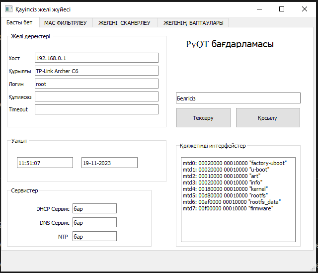
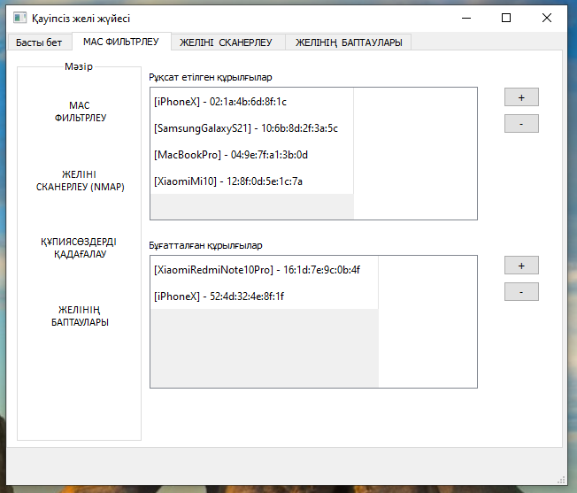
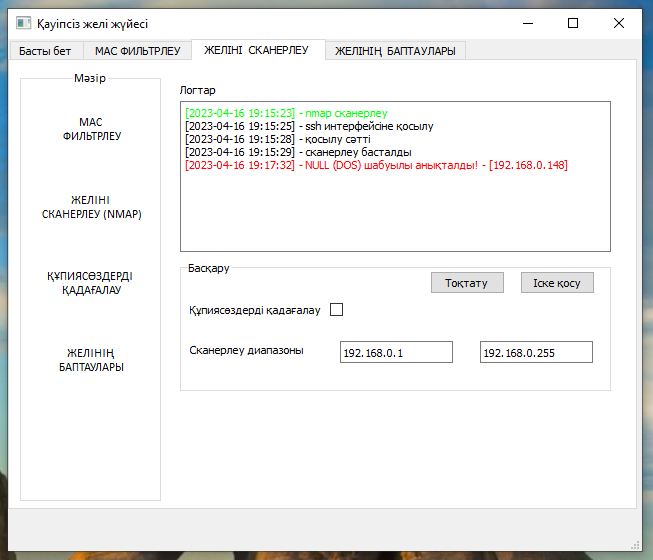
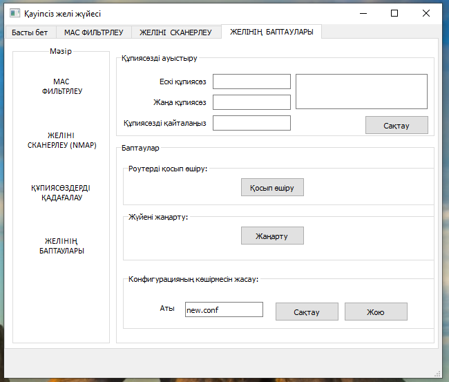
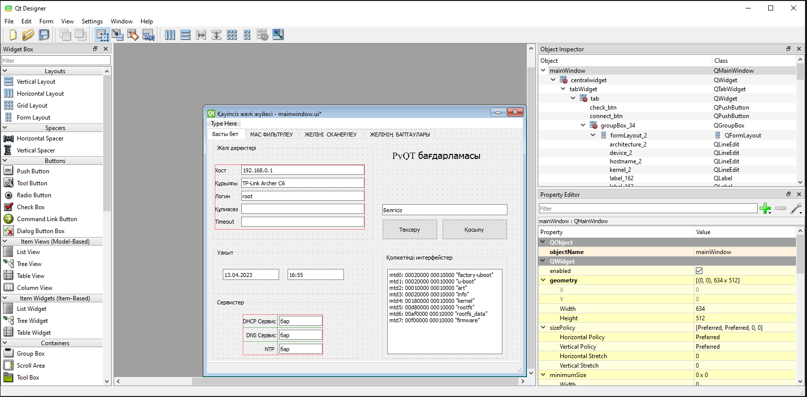

# PyQT мысал қолданбасы
Бұл жоба PyQT көмегімен графикалық пайдаланушы интерфейсін жасаудың мысалы ретінде қызмет етеді және қолданбадағы әртүрлі компоненттердің функционалдығын көрсетеді. Бұл мысалда QT арқылы интерфейсті жасауды және оны Python қолданбасымен байланысуын көруге болады. Бағдарламада түймелер, белгілер, мәтіндік өрістер, кестелер және хабарлар сияқты әртүрлі элементтерді қолдану көрсетілген. Сонымен қатар, командная строка-мен әрекеттесу pyautogui қалай қолдануға болатынын байқай аласыз. Бағдарламадағы барлық функциялар тек мысал болып табылады және маршрутизатормен ешқандай байланысы жоқ.

* Қолданылған тіл: <b>Python 3.7.5</b> 
* Фронтенд: <b>QT + Pyqt</b>

<b>app.py</b> файлында бағдарламаның коды орналасқан.<br>
<b>mainwindow.ui</b> файлында бағдарламаның интерфейсінің коды орналасқан.
## Скриншоттар










Қолданбаның интерфейсін <b>QT designer</b> бағдарламасымен өзгертуге болады. Орнату үшін [осы сілетеме](https://build-system.fman.io/qt-designer-download) бойынша отіңіз.

## Орнату
> GitHub-қа тіркеліп осы жобадағы <b>⭐Star</b> тетігін басыңыз (қалауыңызбен)

[Python](https://www.python.org/) веб-сайтынан Python бағдарламасын орнатыңыз (бұл жүйеге ең қолайлы - 3.7.5 версиясы).

Озіңізге ұнайтын Python бағдарламалау ортасын орнатыңыз, мысалға [Pycharm](https://www.jetbrains.com/ru-ru/pycharm/).

Жобаны жүктеп алып, архивтен шығарып оны кез келген ыңғайлы жерге орналастырыңыз. 

Сосын <b>Командная строка</b>-ны ашып мына командаларды енгізіңіз (жобаның орынын озіңіздін жобаны орналастырған жерімен ауыстырыңыз)

```
cd C:\Users\JZX100\Projects\qt-router-app_kz
python -m venv env
env\Scripts\activate
pip install -r requirements.txt
```
Қолданбаны қосу үшін:
```
python app.py
```

## Байланыс
* Егер сізде осы жоба жайлы сұрақтар туындаса <b>Issues</b> парақшасында сұраныс қалдырсаңыз болады. 
* Менімен осы сілтеме бойынша Telegram желісінде байланысуға болады - [@JZX_I00](https://t.me/JZX_I00). 
